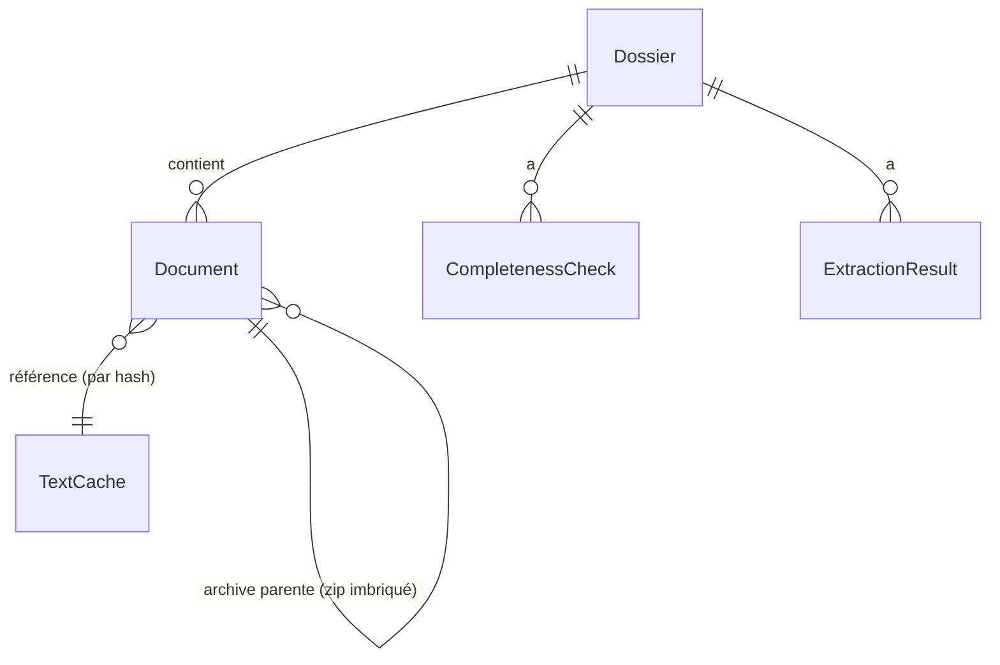
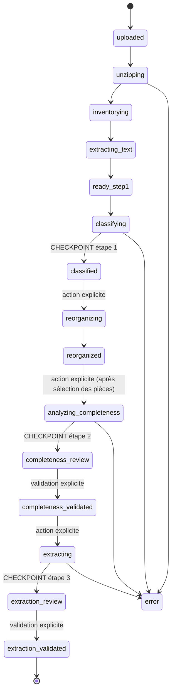
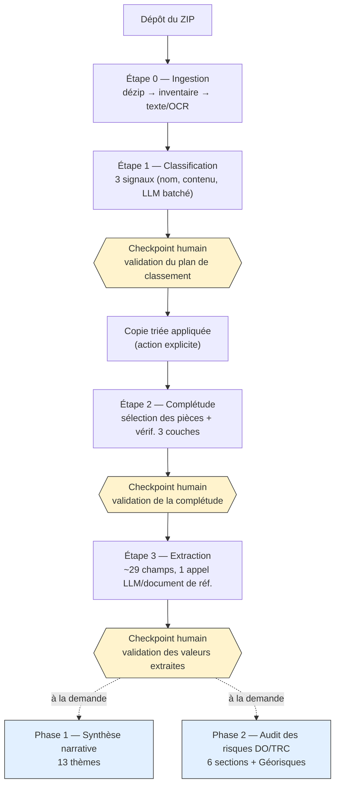
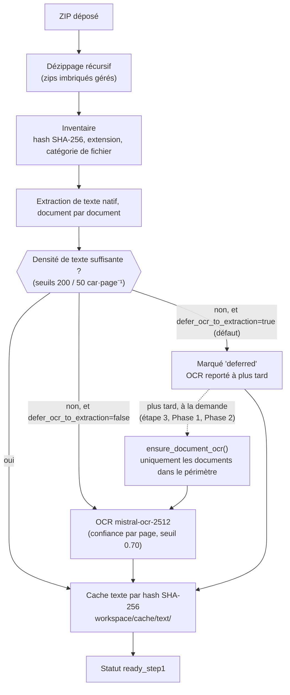
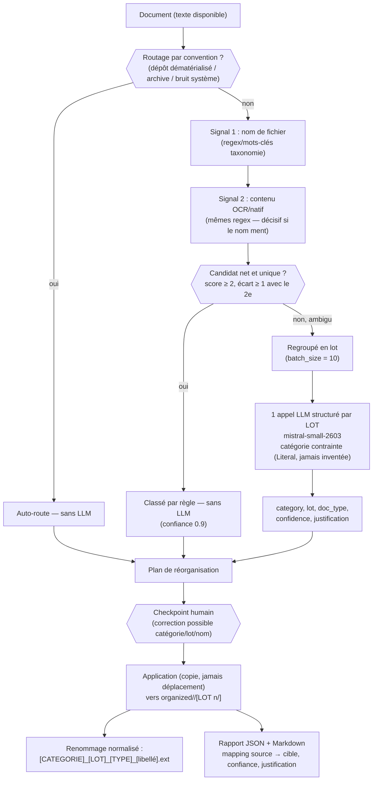
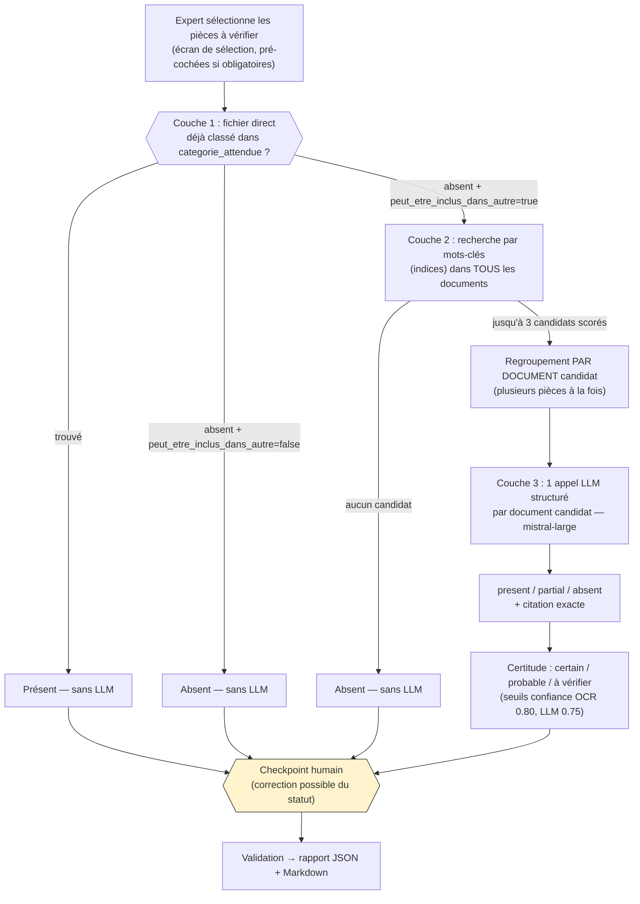
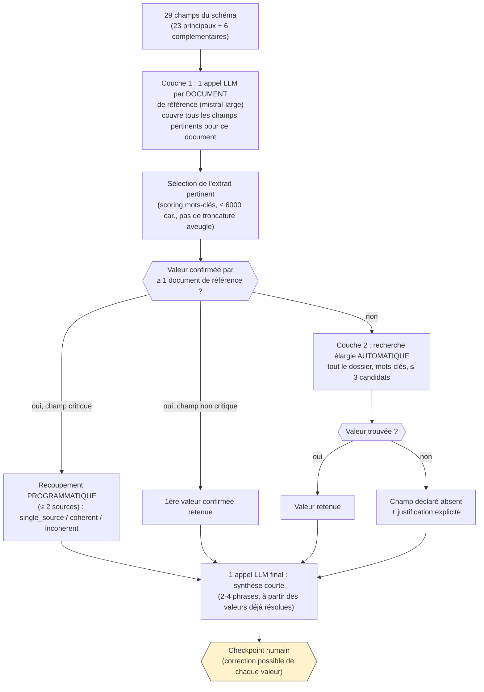
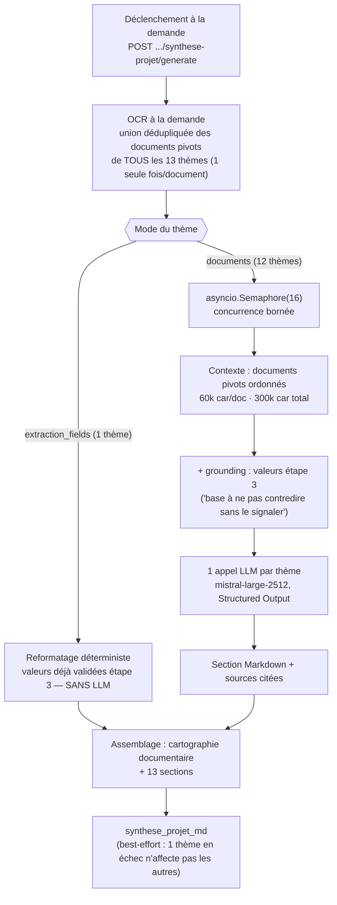
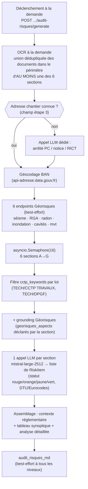

# AOP v2 — Documentation technique

Documentation de référence de l'application, pour quiconque doit la comprendre, la maintenir ou
la faire évoluer. Pour une présentation métier accessible (sans jargon technique), voir
[GUIDE_UTILISATEUR.md](GUIDE_UTILISATEUR.md). Pour un focus dédié aux deux phases d'analyse
avancée, voir [PHASES_ANALYSE.md](PHASES_ANALYSE.md) (repris et complété ici, Parties 9-10).

## Sommaire

1. [Vue d'ensemble](#1-vue-densemble)
2. [Arborescence du dépôt](#2-arborescence-du-dépôt)
3. [Modèle de données & machine à états](#3-modèle-de-données--machine-à-états)
4. [Pipeline complet](#4-pipeline-complet)
5. [Étape 0 — Ingestion](#5-étape-0--ingestion)
6. [Étape 1 — Classification & réorganisation](#6-étape-1--classification--réorganisation)
7. [Étape 2 — Complétude](#7-étape-2--complétude)
8. [Étape 3 — Extraction](#8-étape-3--extraction)
9. [Phase 1 — Synthèse narrative du projet](#9-phase-1--synthèse-narrative-du-projet)
10. [Phase 2 — Audit des risques (DO/TRC)](#10-phase-2--audit-des-risques-dotrc)
11. [Couche IA transverse (Mistral)](#11-couche-ia-transverse-mistral)
12. [API REST & WebSocket](#12-api-rest--websocket)
13. [Frontend](#13-frontend)
14. [Configuration (YAML, jamais en dur)](#14-configuration-yaml-jamais-en-dur)
15. [Stockage & traçabilité (workspace)](#15-stockage--traçabilité-workspace)
16. [Tests](#16-tests)
17. [Déploiement](#17-déploiement)
18. [Annexe — glossaire métier express](#18-annexe--glossaire-métier-express)

---

## 1. Vue d'ensemble

AOP est un outil interne d'aide à l'analyse de DCE (Dossier de Consultation des Entreprises) pour
l'underwriting assurance construction (SMABTP). Il prend un DCE déposé en vrac dans un ZIP, le
trie, vérifie sa complétude, en extrait les informations utiles à l'analyse du risque, puis
produit deux rapports d'analyse avancée (synthèse narrative du projet, audit des risques
DO/TRC) — le tout avec traçabilité systématique et validation humaine à chaque étape.

**Principe directeur non négociable** (README.md) : *« La précision et la traçabilité priment
toujours sur la vitesse et le coût. »* Concrètement :
- OCR systématique sur les documents scannés (avec score de confiance par page) ;
- citation obligatoire pour toute donnée affichée (document + passage exact) ;
- aucune valeur n'est jamais inventée — une information absente est signalée comme telle ;
- le dossier source n'est **jamais** modifié (copie immuable), toute transformation produit une
  copie séparée.

**Stack technique :**

| Couche | Techno |
|---|---|
| Backend | Python, FastAPI, SQLAlchemy (ORM), Pydantic |
| Base de données | SQLite (`workspace/aop.db`) |
| IA | API Mistral — chat structuré (Structured Outputs) + OCR |
| Frontend | React + Vite + TypeScript + Tailwind |
| Communication live | WebSocket (progression), REST (tout le reste) |
| Déploiement | Docker (image unique backend+frontend), Fly.io |

L'application est servie en un seul conteneur/process : FastAPI sert à la fois l'API REST, le
WebSocket et le frontend buildé (fichiers statiques).

---

## 2. Arborescence du dépôt

```
backend/
├── app/
│   ├── main.py              # FastAPI + montage des routers + fichiers statiques frontend
│   ├── settings.py          # config .env + chargement config/*.yaml (avec cache)
│   ├── progress.py          # gestionnaire WebSocket de progression (connexions + historique)
│   ├── pipeline_support.py  # bracket commun aux pipelines (start_stage/finalize_stage/filet de sécurité)
│   ├── api/                 # routes REST + WebSocket (1 fichier par domaine)
│   ├── ingestion/           # étape 0 : dézip, inventaire, routage texte natif/OCR
│   ├── ocr/                 # appel OCR Mistral haut niveau + cache persistant par hash
│   ├── classify/            # étape 1 : taxonomie, moteur 3 signaux, renommage, copie triée
│   ├── completeness/        # étape 2 : checklist de pièces, moteur 3 couches
│   ├── extraction/          # étape 3 : schéma de champs, moteur d'extraction + recoupement
│   ├── synthesis/           # Phase 1 : synthèse narrative (13 thèmes)
│   ├── audit/                # Phase 2 : audit des risques (6 sections) + intégration Géorisques
│   ├── mistral/              # wrapper bas niveau du SDK (retry, throttle, upload, chat structuré)
│   └── store/                 # modèles SQLAlchemy, session, repository (accès DB)
├── config/                   # *.yaml : toute la connaissance métier, jamais en dur dans le code
└── tests/                    # pytest, aucune clé API réelle nécessaire (Mistral mocké)
frontend/
└── src/                       # React + Vite + TypeScript, 1 composant par écran/bloc
workspace/                     # état d'exécution (jamais versionné, recréé au fil de l'eau)
├── <dossier_id>/source/       # copie immuable du ZIP déposé
├── <dossier_id>/organized/    # copie triée générée à l'étape 1
├── cache/text/                # cache de texte extrait, indexé par hash SHA-256
└── aop.db                     # base SQLite
refs/                          # docs de référence métier (protocole d'analyse, barèmes, golden set)
plan/                          # docs de planification/conception d'origine
Dockerfile, fly.toml, start.sh # build & déploiement
```

---

## 3. Modèle de données & machine à états

### 3.1 Tables principales



- **`Dossier`** — une ligne par DCE déposé : `status` (machine à états, §3.2), compteurs par étape
  (`total_files`, `pieces_selected/checked/present/absent`, `fields_total/extracted/present/...`),
  chemins des rapports générés (JSON+Markdown) à chaque checkpoint, et les champs des deux phases
  d'analyse (`synthese_projet_md/status/error/model/generated_at`,
  `audit_risques_md/status/error/model/generated_at`).
- **`Document`** — une ligne par fichier inventorié. Suit le pattern **`proposed_*` / `final_*`**
  systématiquement : la proposition du moteur (classification 3-signaux) n'est **jamais
  écrasée** — elle reste tracée comme décision d'origine — tandis que `final_*` (= la proposition
  par défaut, écrasée uniquement par une correction humaine explicite au checkpoint) est ce qui
  est réellement utilisé par les étapes suivantes. `is_manually_corrected` distingue les deux cas.
- **`TextCache`** — cache persistant de texte extrait (natif ou OCR), **indexé par hash SHA-256 du
  contenu** : un document identique, même dans un autre dossier, n'est jamais ré-extrait ni
  ré-OCRisé. Conserve la méthode, la confiance moyenne, le modèle+version, et un JSON de
  métadonnées par page (bounding boxes OCR).
- **`CompletenessCheck`** — une ligne par (dossier, pièce de la checklist) sélectionnée par
  l'utilisateur. Même pattern `proposed_*`/`final_*` que `Document`.
- **`ExtractionResult`** — une ligne par (dossier, champ du schéma d'extraction) — **tous** les
  champs sont toujours créés (pas de sélection, contrairement à la complétude). Même pattern
  `proposed_*`/`final_*`, plus `cross_check_status` pour les champs critiques.

### 3.2 Machine à états du dossier (`DossierStatus`)



Les 3 checkpoints (`classified`, `completeness_review`, `extraction_review`) sont les seuls
points où le pipeline **attend** une action humaine avant de pouvoir avancer. Chaque checkpoint
est **réouvrable** (`.../reopen`) tant que l'étape suivante n'a pas été lancée, pour permettre une
correction tardive sans tout recommencer.

Les statuts `synthese_projet_status` et `audit_risques_status` (Phases 1/2) sont **indépendants**
de cette machine à états : `not_generated` / `generating` / `done` / `error`, jamais synchronisés
avec `Dossier.status`.

### 3.3 Autres enums notables

| Enum | Valeurs | Usage |
|---|---|---|
| `MatchLayer` | `file`, `content`, `llm`, `none` | quelle couche a résolu une pièce/un champ |
| `Presence` | `present`, `partial`, `absent` | résultat de complétude |
| `Certainty` | `certain`, `probable`, `a_verifier` | fiabilité d'un résultat de complétude |
| `CrossCheckStatus` | `coherent`, `incoherent`, `single_source`, `not_applicable` | recoupement d'un champ d'extraction |
| `TextExtractionMethod` | `native_pdf`, `ocr`, `mixed_pdf`, `docx_native`, `doc_converted`, `spreadsheet_native`, `deferred`, `none` | méthode ayant produit le texte en cache |

---

## 4. Pipeline complet



**Ce qui est automatique vs explicite :**
- Ingestion → Classification : **enchaînées automatiquement** (`_run_pipeline_safely`,
  `api/dossiers.py`) — classer ne demande aucun jugement humain, seule la validation du plan en
  demande un.
- Application de la copie triée, lancement de la complétude (après sélection des pièces),
  lancement de l'extraction, déclenchement des Phases 1/2 : **tous** actions explicites de
  l'utilisateur (boutons dédiés côté frontend, endpoints POST dédiés côté API).

**Filet de sécurité commun** (`app/pipeline_support.py`) : `run_pipeline_safely` enveloppe chaque
pipeline — toute exception non gérée bascule `Dossier.status = error` (avec le message) au lieu de
laisser le dossier bloqué silencieusement à mi-chemin, puis diffuse l'échec sur le WebSocket.
`start_stage`/`finalize_stage` factorisent la partie commune aux 3 pipelines de l'étape 1/2/3
(passage au statut « en cours » + diffusion, puis recalcul des compteurs + statut final +
diffusion) — le corps de chaque pipeline (la vraie logique métier) reste propre à chacun,
volontairement non factorisé.

**Progression live :** un WebSocket par dossier (`/ws/dossiers/{id}`, `app/progress.py`) diffuse
un évènement JSON après chaque étape/document, avec un **historique borné** (200 évènements)
rejoué à la connexion — un écran ouvert tardivement (pipeline déjà avancé) rattrape la
progression au lieu de voir la barre sauter directement à sa valeur finale. Les Phases 1/2
n'utilisent **pas** ce canal (elles feraient dévier `Dossier.status` hors de son énumération) — le
frontend fait un simple polling REST tant que leur statut vaut `generating`.

---

## 5. Étape 0 — Ingestion



**3 sous-étapes** (`app/ingestion/pipeline.py`) : dézippage récursif (`unzip.py`), inventaire
(`inventory.py` — hash SHA-256, extension, catégorie de fichier détectée), extraction de texte
(`text_extraction.py`), chacune diffusée sur le WebSocket.

**Routage natif vs OCR** — basé sur la densité de texte natif par page
(`text_extraction` dans `models.yaml`) : sous 200 caractères/page en moyenne sur un bloc de
pages, OCR de contrôle sur ces pages ; sous 50 caractères/page sur tout le document, considéré
comme scanné/plan → OCR intégral. Les `.doc` legacy sont convertis via LibreOffice (`soffice`) —
sans lui, marqués en erreur explicite plutôt que d'inventer un texte non fiable.

**OCR différé** (`defer_ocr_to_extraction`, activé par défaut) : pendant l'ingestion et les
étapes 1/2, seul le texte natif est utilisé — l'OCR n'a lieu qu'« à la demande »
(`ensure_document_ocr`, `app/ingestion/document_signal.py`) à l'étape 3 et dans les Phases 1/2,
uniquement pour les documents réellement dans le périmètre de l'analyse en cours. Objectif :
jamais payer un appel OCR pour un document qui ne sera finalement jamais utilisé (ex. un CCTP
d'un lot hors sujet pour la section d'audit courante).

**Cache & déduplication :** le texte extrait est mis en cache par **hash de contenu** — un
document identique (même octets), même dans un autre dossier, n'est jamais ré-extrait ni
ré-OCRisé. Dans un même lot d'ingestion, un mécanisme « leader/follower » évite une race
condition d'écriture concurrente sur ce cache pour deux exemplaires identiques traités en
parallèle : un seul représentant par hash part en concurrence (`asyncio.gather`), les doublons
sont traités après, séquentiellement (simple lecture du cache déjà rempli).

---

## 6. Étape 1 — Classification & réorganisation



**Taxonomie** (`config/taxonomy.yaml`, `app/classify/taxonomy.py`) — 31 catégories (ex.
`ADMIN/RC`, `ASS/CCAP`, `TECH/CCTP TRAVAUX`, `TECH/ETUDE DE SOL`, `TECH/RICT`...), chacune avec
`filename_keywords`/`content_indices` (regex), `alt_names`, `lot_aware` (crée un sous-dossier
`LOT <n>` si un numéro de lot est détecté), `doc_type_hint` (code court pour le renommage) et
`is_pivot` (document pivot au sens du protocole d'analyse — signal pour la cartographie
documentaire et la Phase 1, jamais utilisé par le moteur de classification lui-même). Catégorie de
repli absolue : `AUTRES` — aucun fichier n'est jamais perdu.

**Moteur 3 signaux** (`app/classify/engine.py`) :
1. **Nom de fichier** — score par nombre de regex de la taxonomie matchées.
2. **Contenu** (OCR ou natif) — mêmes regex, décisif quand le nom de fichier ment.
3. **LLM** (`mistral-small-2603`, dernier recours) — uniquement pour les documents où 1+2 ne
   suffisent pas (aucun candidat net, candidats à score proche, ou nom générique type
   `scan001.pdf`). Un seul appel structuré **par lot** de 10 documents ambigus (jamais un par
   document) ; la catégorie de sortie est contrainte par un type `Literal` généré dynamiquement
   sur les chemins réels de la taxonomie — structurellement impossible de renvoyer une catégorie
   inventée.

**Routage sans aucune analyse** (auto-route, confiance fixe) : fichiers de dépôt dématérialisé
(`.cle/.cry/.iv/.pli/.xml/.pde/.pdp`), archives déjà décompressées, bruit système — aucun jugement
à faire.

**Renommage** (`app/classify/naming.py`) : convention
`[CATEGORIE]_[LOT]_[TYPE]_[libellé court].ext`, slug ASCII sans accents, troncature **au dernier
séparateur complet** (jamais un mot coupé en plein milieu), déduplication par suffixe numérique en
cas de collision dans le même dossier cible.

**Réorganisation** (`app/classify/reorg.py`) : copie (jamais déplacement) de
`workspace/<id>/source/` vers `workspace/<id>/organized/<catégorie>/[LOT n/]`, déclenchée
explicitement après le checkpoint. Un rapport JSON + Markdown trace intégralement le mapping
source → cible avec confiance, justification et modèle utilisé. Idempotent — peut être réappliqué
après une correction du plan.

---

## 7. Étape 2 — Complétude



**Checklist** (`config/pieces_checklist.yaml`, `app/completeness/pieces_checklist.py`) — 16
pièces réparties en 3 phases métier : **A** constitution du dossier (7 pièces, ex. CCTP des
entreprises, étude de sol G2 PRO, RICT), **B** établissement du contrat (6 pièces, ex. DOC
signée, arrêté PC, attestations décennales par lot), **C** réception du chantier (3 pièces, ex.
RFCT). Chaque pièce déclare une `categorie_attendue` (taxonomie), si elle peut être « noyée »
dans un autre document (`peut_etre_inclus_dans_autre`), des `indices` de recherche, et si sa
couverture doit être vérifiée lot par lot (`par_lot`, ex. attestations décennales).

**Moteur 3 couches** (`app/completeness/engine.py`) :
1. **Fichier direct** — un document déjà classifié (validé à l'étape 1) dans la catégorie
   attendue → présent, sans aucun jugement supplémentaire.
2. **Recherche intra-document** — mots-clés (`indices`) sur le texte de tous les documents,
   uniquement si la pièce peut être noyée ailleurs ; jusqu'à 3 candidats retenus, scorés.
3. **Vérification LLM** (`mistral-large`) — **un appel par document candidat**, demandant en une
   fois la présence de **toutes** les pièces que ce document pourrait couvrir (pas un appel par
   paire pièce/document) : un même document (ex. un marché signé) est souvent candidat pour
   plusieurs pièces à la fois.

Présence renvoyée : `present` / `partial` (passage évoquant le sujet sans preuve suffisante) /
`absent`, toujours avec citation exacte du passage probant. Certitude dérivée des seuils de
confiance OCR (0.80) et LLM (0.75) configurés dans `models.yaml`.

---

## 8. Étape 3 — Extraction



**Schéma** (`config/extraction_schema.yaml`, source `refs/donnees_de_ref.md` Feuil2) — 29 champs :
23 en section « principale » (montants HT/TTC, garanties demandées, équipe MOE, dates, nombre de
niveaux/bâtiments, missions du bureau de contrôle...) et 6 en section « complémentaire »
(distance des avoisinants, référé préventif, stratigraphie...). Chaque champ déclare des
`reference_categories` (catégories taxonomie où le chercher en priorité) et des `indices`
(mots-clés pour la recherche élargie).

**Principe central** — un seul appel LLM **riche par document**, pas par (champ × document) :
pour chaque document déjà classifié dans une catégorie de référence d'au moins un champ,
`analyze_document` extrait en une fois toutes les valeurs pertinentes pour ce document. Le
contexte envoyé n'est pas une troncature aveugle en tête de document mais les **passages les plus
pertinents** (découpage en paragraphes, score par occurrence des mots-clés/libellés des champs
demandés), plafonné à 6000 caractères par appel.

**2 couches :**
1. **Couche 1** — un appel par document de référence (`reference_categories`).
2. **Couche 2** — pour tout champ resté introuvable après la couche 1, une **recherche élargie
   automatique** par mots-clés sur l'**ensemble du dossier** (pas seulement les catégories de
   référence), plafonnée à 3 documents candidats — déclenchée automatiquement dans le run
   standard, sans action de l'expert. Seuls les champs encore introuvables après la couche 2 sont
   déclarés absents.

**Recoupement (cross-check)** — pour les champs critiques
(`montants_totaux_ht`, `montants_totaux_ttc`, `garanties_demandees`, `date_debut_travaux`,
`date_fin_previsionnelle`), les valeurs obtenues indépendamment sur plusieurs documents de
référence sont comparées **programmatiquement** (jamais un appel LLM dédié) : `single_source` (1
seule source), `coherent` (valeurs concordantes), ou `incoherent` (valeurs divergentes, listées
explicitement par fichier — à trancher humainement au checkpoint).

**Sélection manuelle de documents** — alternative au run standard : l'expert restreint tout le
run à des documents choisis dans l'arborescence organisée ; chaque document sélectionné est
interrogé pour **tous** les champs (pas de filtrage par catégorie), et la couche 2 est
**désactivée** (le périmètre a déjà été choisi, l'élargir irait à l'encontre du choix de
l'expert).

**Synthèse IA courte** — en fin d'étape 3, un unique appel LLM (2-4 phrases) construit **à partir
des valeurs déjà résolues et validées**, jamais une relecture des documents bruts — à ne pas
confondre avec la Phase 1 (ci-dessous), bien plus longue et coûteuse, qui elle relit le texte
intégral des documents pivots.

**Parallélisation** — longtemps la seule étape encore séquentielle (un document après l'autre, OCR
à la demande puis appel LLM, à la suite), contrairement aux Phases 1/2 déjà en concurrence bornée.
Alignée sur le même schéma depuis 2026-08 : OCR à la demande sur l'ensemble des documents
concernés lancée d'un coup (`asyncio.gather`, dédupliquée par document, bornée globalement par
`ocr.max_concurrency`), puis un appel LLM par document (couches 1 et 2) sous `asyncio.Semaphore(8)`
— voir §11.5 pour la justification du chiffre 8. Mesuré sur `dce_grand_pic2.zip` (36 fichiers,
50 champs) : 729,6s en séquentiel → 141,8s en parallèle à cache OCR égal, soit ~5,15x plus rapide,
résultats identiques (aucune valeur perdue, 0 erreur).

---

## 9. Phase 1 — Synthèse narrative du projet



Rapport en **13 thèmes narratifs** (`config/synthese_projet_schema.yaml`), déclenché explicitement
par l'expert une fois l'étape 3 lancée (`extraction_review`/`extraction_validated`), jamais
enchaîné automatiquement — best-effort et jamais bloquant (son propre statut
`synthese_projet_status`, un échec n'affecte jamais `Dossier.status`).

Un thème reformate simplement des valeurs déjà validées (identité de l'opération, sans appel LLM)
; les 12 autres relisent le texte intégral des documents pivots du thème via un appel LLM dédié,
avec un bloc de **grounding** optionnel (valeurs étape 3 déjà validées, à ne pas contredire sans
le signaler). Budgets de contexte calibrés sur la fenêtre ~128k tokens de `mistral-large-2512` :
60 000 caractères/document, 300 000 caractères au total par thème — l'**ordre** des catégories
pivots déclarées est significatif (au-delà du budget, un candidat supplémentaire est simplement
absent du prompt).

OCR fait une seule fois en amont sur l'union dédupliquée des documents candidats de tous les
thèmes (un document partagé comme le RICT n'est pas ré-OCRisé par thème). Les 13 thèmes sont
générés en **concurrence bornée** (`asyncio.Semaphore(16)`) plutôt qu'en séquence stricte (ancien
temps : 190-400s/dossier, somme de 12 appels indépendants) — voir §11.5 pour la mesure empirique
qui a fait passer ce chiffre de 4 à 8 puis à 16.

*Détail complet (prompts, grille de sélection documentaire, exemples de bugs corrigés) :
[PHASES_ANALYSE.md §2](PHASES_ANALYSE.md#2-phase-1--synthèse-narrative-du-projet).*

---

## 10. Phase 2 — Audit des risques (DO/TRC)



Audit critique en **6 sections d'ouvrage A→G** (`config/audit_risques_schema.yaml`) : A&B
Fondations/parties enterrées, C Superstructure, D Étanchéité/Couverture, E Façades, F
Équipements/ENR/Fluides, G Aménagements intérieurs. Chaque section produit, via un unique appel
LLM, une **liste de risques structurés** (statut 🔴/🟠/🟡/🟢, exposé, analyse au regard des
DTU/Eurocodes, impact assurabilité, recommandation de levée de doute, source) — consigne explicite
de matérialité (2 à 5 risques structurants par section, pas un inventaire exhaustif).

Les catégories « par lot » (CCTP travaux, DPGF) sont filtrées par `cctp_keywords` propres à
chaque section, pour ne pas saturer le budget de contexte avec des lots hors sujet.

**Intégration Géorisques** (georisques.gouv.fr) : géocodage de l'adresse du chantier (API Adresse
du gouvernement/BAN — avec fallback LLM sur l'arrêté PC/la notice/le RICT si le champ d'extraction
est vide), puis interrogation de 6 endpoints publics (zonage sismique, retrait-gonflement des
argiles, radon, inondation/GASPAR, cavités, mouvements de terrain). Toute la chaîne est
**best-effort** — jamais bloquante, une panne réseau produit un rapport partiel plutôt qu'un
échec. Chaque section ne reçoit que les aspects Géorisques qu'elle a explicitement déclarés
pertinents.

*Détail complet (grille de risques métier, prompts, endpoints Géorisques) :
[PHASES_ANALYSE.md §3](PHASES_ANALYSE.md#3-phase-2--audit-des-risques-do--trc).*

---

## 11. Couche IA transverse (Mistral)

### 11.1 Modèles utilisés (`config/models.yaml`)

| Modèle | Usage | Pourquoi |
|---|---|---|
| `mistral-large-2512` | Complétude, extraction, synthèse IA courte, Phase 1, Phase 2 | tâches de raisonnement/extraction de qualité |
| `mistral-small-2603` | Classification batchée (étape 1) | tâche jugée facile — moins cher, n'entame pas le quota du grand modèle |
| `mistral-medium-2604` | Fallback multimodal (documents à forte composante image) | remplace Pixtral, retiré du catalogue Mistral |
| `mistral-ocr-2512` | OCR de tous les documents scannés | modèle dédié |

Versions **datées et épinglées** en prod (reproductibilité — une version `-latest` peut changer
sans préavis) ; `-latest` reste disponible pour le dev via `fallback_latest`.
`temperature: 0.0` partout (reproductibilité), relevée légèrement (jusqu'à 0.4) uniquement en
ré-essai après une réponse JSON invalide (casser une sortie déterministe malformée).
`max_tokens: 8000` explicite (les sections d'audit/thèmes de synthèse produisent de longs
contenus structurés ; sans plafond, une réponse tronquée casse le parsing JSON).

### 11.2 `app/mistral/client.py` — wrapper bas niveau

Point d'entrée unique de tout appel Mistral (`call_structured_chat`, `call_ocr`,
`upload_file_for_ocr`). Responsabilités :
- **Throttling** : file LLM chat avec espacement minimal entre appels sur une même clé
  (`min_interval_seconds`, verrou par clé/« slot ») ; **concurrence bornée par un
  `asyncio.Semaphore`** côté appelant (extraction, Phase 1, Phase 2 — voir §11.5) pour permettre
  plusieurs appels LLM en vol à la fois, sans quoi le débit reste borné par la latence d'un seul
  appel (médiane ~10-15s) ; file OCR à concurrence bornée par sémaphore (`ocr.max_concurrency`),
  cadencée indépendamment.
- **Retry réseau/API** : backoff exponentiel (`2^tentative`, plafonné à 30s) sur `MistralError`
  — couvre notamment le `429 rate_limited`, avec mise en quarantaine progressive de la clé
  fautive (§11.5) le temps qu'elle se libère.
- **Retry de parsing** : sur JSON structuré invalide (guillemet non échappé, troncature — erreur
  qui survient *après* un succès HTTP, donc hors du retry réseau), ré-essai avec température
  légèrement relevée (`parse_retries`).
- **Logging d'usage** : chaque appel LLM logge `USAGE llm what=... model=... prompt_tokens=...
  completion_tokens=... total_tokens=...` ; chaque appel OCR logge `USAGE ocr file=...
  pages_processed=... doc_size_bytes=...` (uniquement en sortie de log, aucune persistance ni
  agrégation de coût actuellement).

### 11.3 Structured Outputs — jamais de texte libre à parser

Toute réponse LLM est un **JSON Schema strict** dérivé d'un modèle Pydantic — jamais du texte à
parser après coup. Pour contraindre les valeurs à un ensemble connu à l'exécution (catégories de
taxonomie, ids de pièces, ids de champs), les modèles Pydantic sont **générés dynamiquement**
(`pydantic.create_model`) avec un type `Literal[...]` construit sur les valeurs réelles au moment
de l'appel — structurellement impossible pour le LLM de renvoyer une valeur hors de cette liste.
Un validateur Pydantic partagé (`confidence_validator()`, `app/mistral/validation.py`) clampe
systématiquement toute confiance renvoyée entre 0 et 1.

### 11.4 Principe de batching, commun à toutes les étapes

Jamais un appel LLM par unité élémentaire — toujours groupé par la dimension qui limite le nombre
d'appels sans perdre en pertinence :

| Étape | Granularité d'un appel LLM |
|---|---|
| Classification | 1 appel par **lot** de documents ambigus (batch_size=10) |
| Complétude | 1 appel par **document** candidat, couvrant plusieurs pièces à la fois |
| Extraction | 1 appel par **document** de référence, couvrant plusieurs champs à la fois |
| Phase 1 | 1 appel par **thème** (12 thèmes sur 13, le 13e sans LLM) |
| Phase 2 | 1 appel par **section** (6 sections) |

Et une règle avant l'appel LLM à chaque fois que c'est possible : classification par règles
(signal net), résolution complétude/extraction en couche 1 sans LLM si le fichier direct suffit,
recoupement calculé programmatiquement plutôt que par un appel LLM dédié.

### 11.5 Choix de la concurrence LLM — mesure empirique du rate limit réel

Le compte Mistral utilisé est un **compte à l'usage, sans abonnement/palier payant dédié** — les
limites de débit qui s'y appliquent sont donc a priori plus basses que celles d'un compte
entreprise, et surtout **non garanties dans la durée** (peuvent changer sans préavis selon la
consommation). Le tableau `modeles_mistral_limites.md` (racine du dépôt), copié depuis la console
Mistral pour ce compte, annonçait par exemple **0,07 requête/seconde pour `mistral-large-2512`**
(~4 requêtes/minute) — un chiffre qui, pris au pied de la lettre, aurait rendu toute
parallélisation inutile : à ce débit, même un traitement strictement séquentiel (un appel toutes
les ~10-15s) sature déjà la limite affichée.

**Plutôt que de se fier à ce chiffre, il a été vérifié empiriquement avant d'implémenter quoi que
ce soit** (script de test autonome, hors du code applicatif, utilisant directement
`call_structured_chat` avec la vraie clé API du compte) :
- Appels concurrents à `mistral-large-2512`, paliers de concurrence 1 → 4 → 8 → 12 → 16, deux
  gabarits de prompt : un court (proche d'un appel d'extraction, extrait ≤ 6000 caractères) et un
  long (proche d'un appel « map » d'audit/synthèse, texte intégral ~26 000 caractères,
  `max_tokens=16000`).
- Résultat : **0 échec/429 jusqu'à 16 appels simultanés**, sur les deux gabarits. Débit passant de
  ~5 appels/min en séquentiel à ~30/min à concurrence 8, ~37/min à concurrence 16 — mais
  rendements décroissants et latence par appel qui augmente au-delà de 8 (signe d'un début de
  ralentissement côté serveur, avant tout rejet franc).
- **8 retenu** comme valeur de concurrence pour l'extraction (étape 3), la Phase 1 et la Phase 2
  (`_EXTRACTION_LLM_CONCURRENCY`, `_SYNTHESIS_LLM_CONCURRENCY`, `_AUDIT_LLM_CONCURRENCY` — toutes
  fixées à 4 auparavant, sans mesure) : une marge volontaire sous le plus haut palier testé sans
  erreur (16), parce que le compte est sans garantie contractuelle de débit et que les prompts
  réels (taille d'extrait, nombre de champs par lot) sont plus variables que le gabarit de test.
- Confirmé en conditions réelles sur `dce_grand_pic2.zip` (§8) : le run parallèle a rencontré un
  vrai `429` une fois, absorbé automatiquement par le retry/quarantaine de `app/mistral/client.py`
  (§11.2) sans aucune perte de donnée — la marge prise (8 plutôt que 16) est directement ce qui
  rend cet incident absorbable sans casser le pipeline.

**2026-08-12, Phase 1 et Phase 2 relevées de 8 à 16** — le gabarit synthétique ci-dessus reste
prudent par construction : il ne dit rien de la charge d'un **vrai** run map-reduce sur un **vrai**
dossier volumineux. Testé directement (`run_project_synthesis_pipeline`/`run_audit_pipeline`
appelés en surchargeant le module au runtime, sans script hors-projet) sur `dce_chu_rouen.zip`
(84 fichiers) à 8/16/20/24/40 :
- **Phase 1** (51 appels map + thèmes) : 0 échec/429 à **tous** les paliers, y compris 40 (quasi
  non-borné pour ce dossier). Temps non monotone au-delà de 16, mais 16 reste le point le plus
  rapide mesuré (317,8s contre 410,1s à 8).
- **Phase 2** (24 appels map + 6 sections) : 0 `429` à tous les paliers, mais de vrais échecs
  ponctuels (timeout de **lecture**, `llm.timeout_seconds=300`, sur des CCTP techniques
  volumineux) — 1/24 à concurrence 8, 0/24 à 16, 2/24 à 24. Absorbés sans casser le rapport (repli
  sur extrait brut tronqué). Échantillon trop petit pour établir un lien de cause à effet clair
  avec le palier de concurrence, mais 16 reste le meilleur point mesuré sur les trois.

`_SYNTHESIS_LLM_CONCURRENCY` et `_AUDIT_LLM_CONCURRENCY` relevées à 16 sur cette base (pas
`_EXTRACTION_LLM_CONCURRENCY`, non retestée sur un dossier de cette taille — restée à 8). Détail
complet, tableaux et logs bruts :
`test-runs/campagnes/2026-08-12_phase1-2-concurrence-limites/RAPPORT_CONCURRENCE.md`.

**OCR** (`ocr.max_concurrency`) laissé à sa valeur prudente existante (3) : un test dédié n'a pas
donné de signal exploitable (le fichier de test choisi automatiquement s'est avéré être un scan
géotechnique de plus de 50 Mo, dont le temps de traitement dominait largement toute mesure de rate
limit) — à revérifier avec un fichier plus représentatif si l'OCR devient à son tour un goulot
d'étranglement identifié.

---

## 12. API REST & WebSocket

Toutes les routes sont préfixées `/api/dossiers`, montées dans `app/main.py`. Un routeur par
domaine (`app/api/*.py`) :

| Fichier | Domaine | Endpoints clés |
|---|---|---|
| `dossiers.py` | Cycle de vie du dossier | `POST /` (upload ZIP), `GET /`, `GET /{id}`, `DELETE /{id}`, `GET /{id}/documents`, `GET /{id}/documents/{doc_id}/text`, `GET /{id}/documents/{doc_id}/file` (sert le fichier original) |
| `classification.py` | Étape 1 | `GET /{id}/classification`, `PATCH /{id}/documents/{doc_id}/classification` (correction), `POST /{id}/reorganize/apply`, `POST /{id}/reorganize/reopen`, `GET /{id}/reorganize/report` |
| `completeness.py` | Étape 2 | `GET /{id}/completeness`, `PATCH /{id}/completeness/selection`, `POST /{id}/completeness/run`, `PATCH /{id}/completeness/{piece_id}` (correction), `POST /{id}/completeness/validate`, `POST /{id}/completeness/reopen`, `GET /{id}/completeness/report` |
| `extraction.py` | Étape 3 | `GET /{id}/extraction`, `POST /{id}/extraction/run`, `PATCH /{id}/extraction/{field_id}` (correction), `POST /{id}/extraction/validate`, `POST /{id}/extraction/reopen`, `GET /{id}/extraction/report` |
| `project_synthesis.py` | Phase 1 | `POST /{id}/synthese-projet/generate` |
| `audit.py` | Phase 2 | `POST /{id}/audit-risques/generate` |
| `websocket.py` | Progression live | `WS /ws/dossiers/{id}` |

**Pattern commun aux 3 étapes 1/2/3** : `run` (lance le moteur) → checkpoint (`GET` liste des
résultats proposés) → `PATCH` par item pour corriger manuellement → `validate` (fige les valeurs
finales, écrit le rapport JSON+Markdown, passe au statut suivant) → `reopen` (revient en arrière
tant que l'étape suivante n'a pas démarré).

**Téléchargement de fichier original** — `GET .../documents/{id}/file` sert le PDF/DOCX/etc. tel
qu'uploadé (jamais une version modifiée), pour qu'un expert puisse vérifier une valeur extraite en
un clic. Le chemin est résolu et validé (`relative_to`) contre le dossier source pour empêcher
toute traversée de chemin en dehors du workspace du dossier.

**Détection de doublon à l'upload** — un hash SHA-256 du ZIP entier (`upload_sha256`, distinct du
hash par document) permet de détecter qu'un dossier déjà déposé ressemble à un nouvel upload ;
c'est un **avertissement non bloquant** seulement (`duplicate_of_dossier_id/filename/created_at`)
— un même DCE peut légitimement être ré-analysé (ex. après mise à jour de la taxonomie).

---

## 13. Frontend

React + Vite + TypeScript + Tailwind, servi par le backend en production (`npm run build` →
fichiers statiques montés par FastAPI) ; en dev, serveur Vite séparé avec proxy `/api`/`/ws`
(`vite.config.ts`).

| Composant | Rôle |
|---|---|
| `App.tsx` | Racine, routage entre liste des dossiers et détail d'un dossier |
| `UploadDropzone.tsx` | Dépôt du ZIP |
| `DossierList.tsx` | Liste des dossiers déjà traités |
| `DossierProgress.tsx` | Écran de suivi live (branché sur le WebSocket de progression) |
| `StatusBadge.tsx` | Affichage du statut courant du dossier |
| `ReorganizationPlan.tsx` | Écran de validation du plan de classement (étape 1) |
| `OrganizedTree.tsx` | Arborescence de la copie triée |
| `CompletenessChecklist.tsx` | Sélection des pièces + validation des résultats (étape 2) |
| `ExtractionSheet.tsx` | Résultats d'extraction (étape 3), déclenchement des Phases 1/2, affichage des rapports, fusion + téléchargement du rapport combiné |
| `DossierSummary.tsx` | Synthèse IA courte affichée en tête de dossier |
| `Markdown.tsx` | Rendu Markdown des rapports (Phase 1/2, synthèse) |
| `ReopenButton.tsx` | Bouton générique de réouverture d'un checkpoint |
| `CollapsiblePanel.tsx` | Panneau repliable réutilisable |
| `statusFlow.ts` | Logique de progression/dérivation d'état à partir de `DossierStatus` côté client |
| `api.ts` / `types.ts` | Client HTTP + types partagés avec le backend |

Pattern de communication : WebSocket pour la progression live des étapes 0-3 (un écouteur par
dossier ouvert), polling REST pour les Phases 1/2 (statut `generating` → `done`/`error`), REST
classique pour tout le reste (lecture/écriture ponctuelle).

---

## 14. Configuration (YAML, jamais en dur)

Toute la connaissance métier (catégories, champs, pièces, thèmes, sections, seuils, modèles) est
externalisée dans `backend/config/*.yaml` — jamais codée en dur dans le Python. Chaque schéma
s'auto-valide au chargement (assertions sur ids dupliqués, champs requis selon le mode) et est mis
en cache (`lru_cache`) pour ne pas relire le disque à chaque appel.

| Fichier | Modélise | Consommé par |
|---|---|---|
| `taxonomy.yaml` | 31 catégories de classement (étape 1) | `classify/` |
| `pieces_checklist.yaml` | 16 pièces de complétude, phases A/B/C (étape 2) | `completeness/` |
| `extraction_schema.yaml` | 29 champs à extraire (étape 3) | `extraction/` |
| `synthese_projet_schema.yaml` | 13 thèmes narratifs (Phase 1) | `synthesis/` |
| `audit_risques_schema.yaml` | 6 sections A→G, grille de risques (Phase 2) | `audit/` |
| `models.yaml` | Modèles Mistral épinglés, seuils, budgets, concurrence, feature flags | tous |

Bénéfice principal : une évolution métier (ajouter une pièce, ajuster un seuil, changer de modèle
après dépréciation côté Mistral) se fait dans la config, sans toucher au code applicatif.

---

## 15. Stockage & traçabilité (workspace)

```
workspace/
├── <dossier_id>/
│   ├── source/                    # copie immuable du ZIP déposé — jamais modifiée
│   ├── organized/                 # copie triée (étape 1), jamais la source
│   │   └── organized_report.{json,md}
│   ├── completeness_report.{json,md}
│   └── extraction_report.{json,md}
├── cache/
│   └── text/<hash[:2]>/<hash>.md        # texte extrait, en cache par hash SHA-256 de contenu
│   └── text/<hash[:2]>/<hash>.ocr.json  # réponse OCR brute (confiance/page, bounding boxes)
└── aop.db                          # SQLite : dossiers, documents, cache, résultats — toute
                                     # décision porte confiance, méthode, modèle+version, horodatage
```

`workspace/` n'est **jamais versionné** dans le dépôt (`.gitignore`) — il est recréé au fil de
l'eau à l'exécution. En production (Fly.io), il est monté sur un volume persistant (`/data`, voir
§17).

`AOP_WORKSPACE_DIR` : si personnalisé dans `.env`, doit être un chemin **absolu** — une valeur
relative comme `./workspace` pointerait vers `backend/workspace/` (non couvert par
`.gitignore`) plutôt que vers la racine du dépôt.

---

## 16. Tests

```bash
cd backend
uv run pytest -v
```

Un module de test par domaine (`backend/tests/test_*.py`), plus des tests d'intégration API par
étape (`test_api_*_integration.py`). **Aucune clé API Mistral réelle nécessaire** : les appels
sont simulés par `monkeypatch` pour les cas nécessitant de l'OCR/LLM ; certains scénarios de bout
en bout sont validés via l'API réelle sur des documents à texte natif dense (aucun OCR déclenché,
donc pas de coût/clé requis pour ces cas-là non plus en pratique de CI).

---

## 17. Déploiement

**Image Docker unique** (`Dockerfile`, multi-stage) : le frontend est buildé dans un premier
stage Node, puis copié dans le stage final Python (`uv`, image slim) qui sert à la fois l'API et
les fichiers statiques. `uvicorn` est appelé directement en CMD (pas `uv run`) pour éviter une
re-synchronisation du venv (incluant les dépendances dev) à chaque démarrage de conteneur.

**Fly.io** (`fly.toml`) : un seul conteneur, région `cdg`, `AOP_WORKSPACE_DIR=/data` monté sur un
volume persistant (`aop_data`) qui porte la base SQLite, les documents et le cache OCR — sans ce
volume, tout l'état serait perdu à chaque redéploiement. Machine auto-stop/auto-start (scale à
zéro entre les usages), 1 vCPU partagé / 1 Go RAM. Déploiement :
```bash
fly apps create aop-v2
fly volumes create aop_data --region cdg -n 1
fly secrets set MISTRAL_API_KEY=...
fly deploy
```

**Local** (`start.sh`) : build frontend + installation des dépendances backend (`uv sync`) +
lancement d'`uvicorn` en une commande, sur `localhost:8000`.

---

## 18. Annexe — glossaire métier express

| Sigle | Signification |
|---|---|
| DCE | Dossier de Consultation des Entreprises |
| MOA / MOE | Maître d'Ouvrage / Maîtrise d'Œuvre |
| BET | Bureau d'Études Techniques |
| CCTP / CCAP | Cahier des Clauses Techniques / Administratives Particulières (existe en version travaux ET en version assurance) |
| RICT / RFCT | Rapport Initial / Final de Contrôle Technique |
| G1, G2 AVP, G2 PRO, G4, G5 | Missions géotechniques normalisées (étude de sol) |
| DOC / OS | Déclaration d'Ouverture de Chantier / Ordre de Service |
| TRC | Tous Risques Chantier (garantie) |
| DO | Dommages-Ouvrage (garantie) |
| CNR / CCRD / RCMOA / TRM | autres garanties d'assurance chantier (voir PHASES_ANALYSE.md / QUIZ_ENTRETIEN.md) |
| RGA | Retrait-Gonflement des Argiles |
| PPRN / PPRI | Plan de Prévention des Risques Naturels / d'Inondation |
| ATec / ATEx / TNC | Avis Technique / Appréciation Technique d'Expérimentation / Technique Non Courante |
| DTU | Document Technique Unifié |

Pour un glossaire complet et des questions de compréhension approfondies (métier + technique),
voir [QUIZ_ENTRETIEN.md](QUIZ_ENTRETIEN.md).
