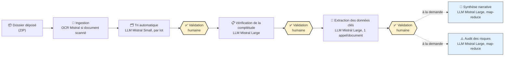
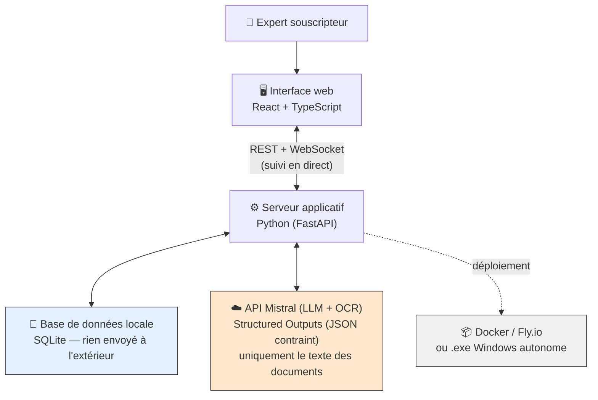
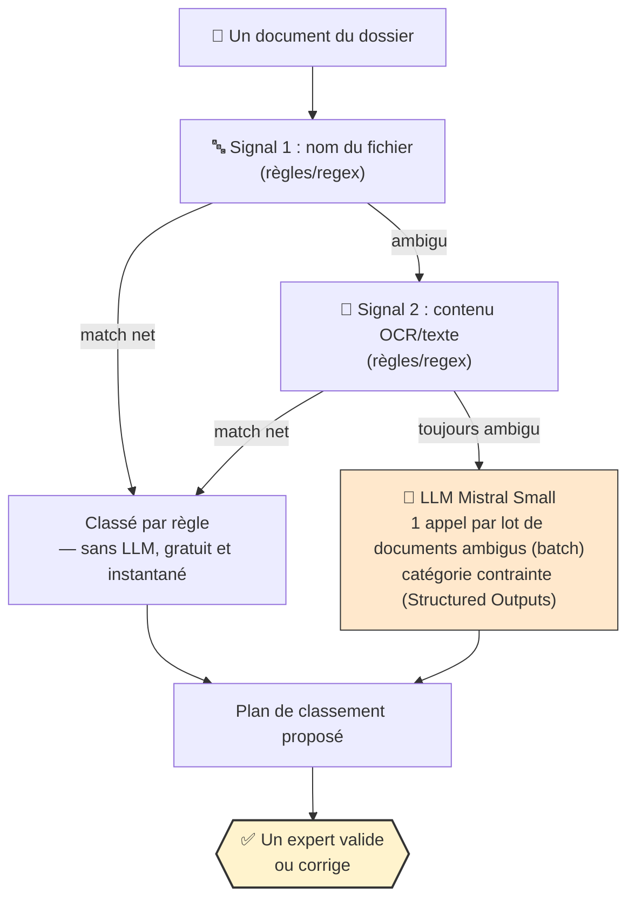
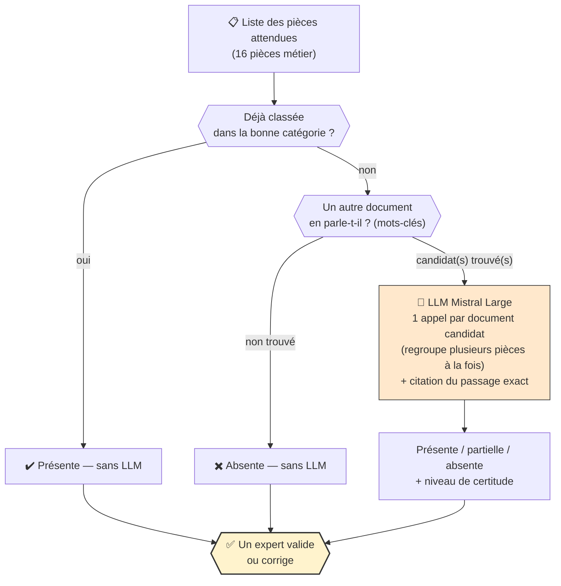
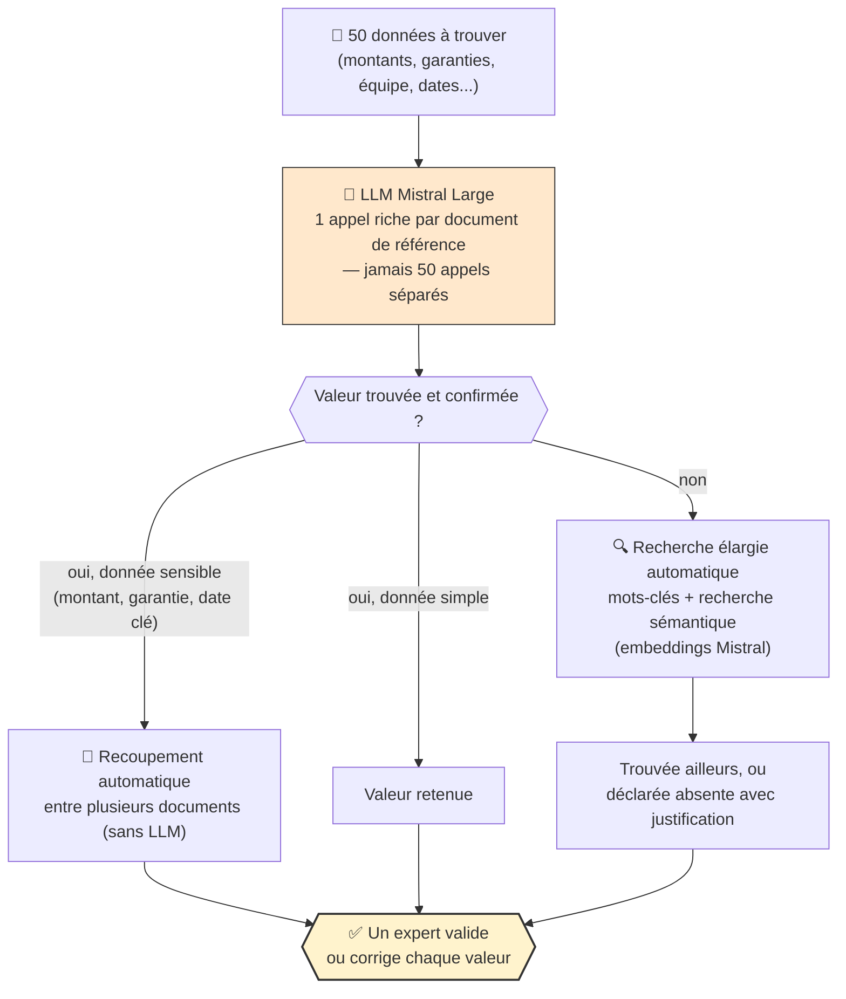
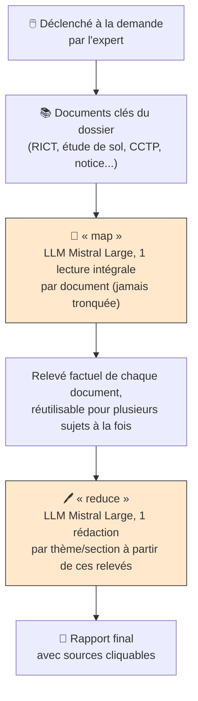
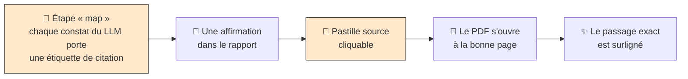
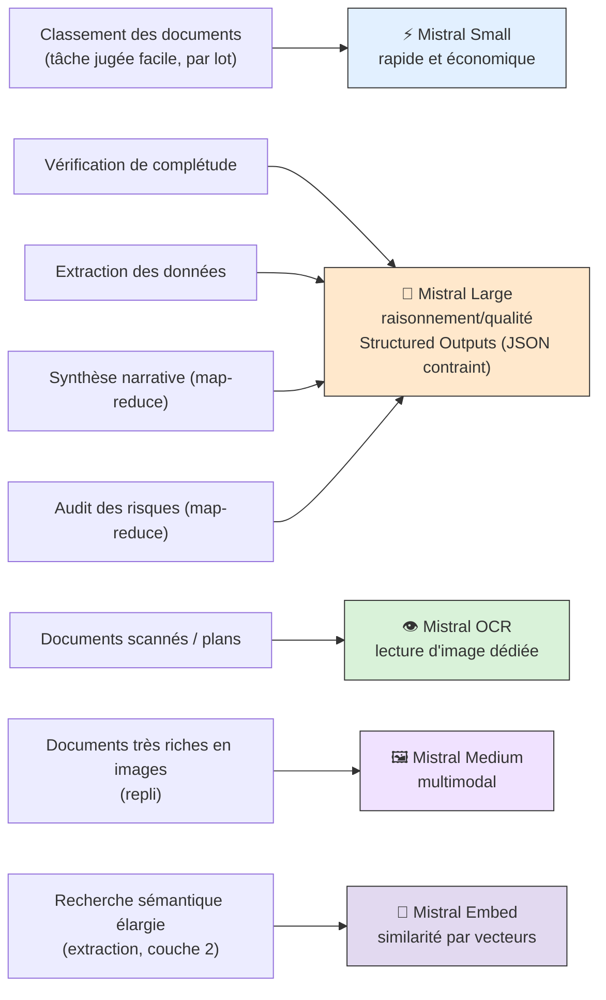
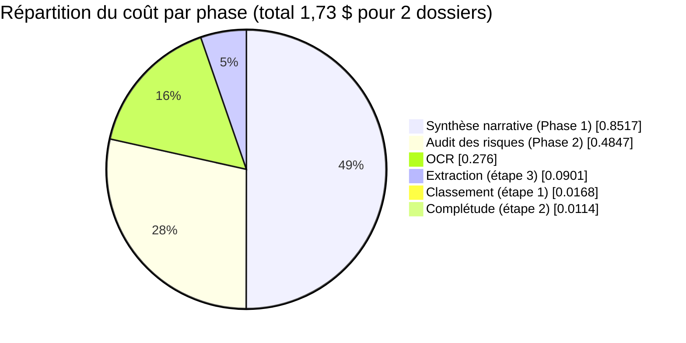
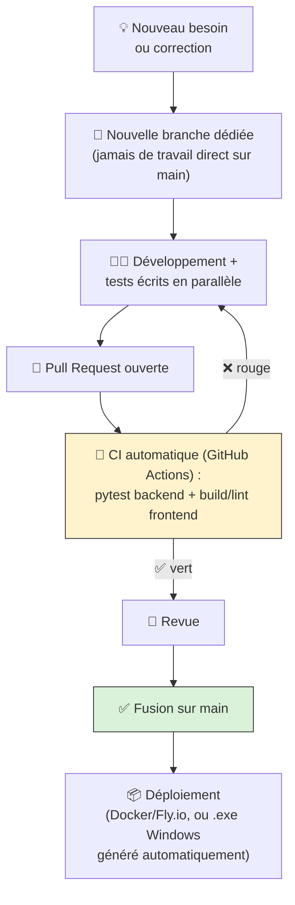

# Diagrammes Mermaid — à exporter pour le diaporama

Chaque diagramme est délibérément **plus simple et plus visuel** que ceux de
`docs/ARCHITECTURE.md` (pas de noms de fichiers, de fonctions, de seuils numériques précis) : ils
sont pensés pour un public technique qui connaît les concepts IA (LLM, OCR, embeddings,
map-reduce...) mais pas ce projet — les modèles utilisés et les techniques clés (batch,
Structured Outputs, map-reduce) sont donc nommés, sans détailler l'implémentation. Référencés
depuis `00_PLAN_DIAPOS.md` par leur identifiant (D1, D2...).

**Comment exporter en image** (pour coller dans PowerPoint/Google Slides/Keynote) :
- le plus simple : coller le bloc de code dans [mermaid.live](https://mermaid.live), puis
  exporter en PNG ou SVG (fond transparent possible) ;
- ou l'extension "Markdown Preview Mermaid Support" de VS Code, clic droit → export ;
- ou en ligne de commande avec `mmdc` (`@mermaid-js/mermaid-cli`) si vous en exportez beaucoup
  d'un coup.

---

## D1 — Vue d'ensemble du pipeline

## D2 — Stack technique en un coup d'œil

## D3 — Étape 1 : classement automatique (simplifié)

## D4 — Étape 2 : vérification de la complétude (simplifié)

## D5 — Étape 3 : extraction des données (simplifié)

## D6 — Phases 1 & 2 : le principe commun (« lire une fois, rédiger ensuite »)

*Pattern **map-reduce** : tous les appels « map » (un par document) puis tous les appels
« reduce » (un par thème/section) sont lancés en parallèle, à concurrence bornée, plutôt qu'en
séquence — sinon le temps total serait la somme de dizaines d'appels LLM indépendants.
Phase 1 = 15 thèmes narratifs (identité du projet, ouvrage, équipe, sol...). Phase 2 = 6 sections
de risques A→G (fondations, superstructure, étanchéité, façades, équipements, aménagements),
enrichies par les données publiques Géorisques du lieu du chantier.*

## D7 — Le mécanisme de citation vérifiable

*C'est ce qui transforme un rapport généré par IA en un document de travail auditable — chaque
phrase se vérifie en un clic, jamais "à la confiance".*

## D8 — Les modèles IA utilisés, et où

*Toutes les réponses LLM (Small et Large) passent par les **Structured Outputs** de l'API
Mistral : la réponse est contrainte à un schéma JSON strict, jamais du texte libre à reparser —
c'est ce qui rend une catégorie ou une valeur hors périmètre structurellement impossible à
renvoyer.*

## D9 — Répartition du coût par phase (run réel mesuré)

> ⚠️ Chiffres du 2026-07-29 (2 dossiers réels traités intégralement, coût total 1,73 $) — à
> remplacer par le run du 2026-08-18 une fois terminé (voir `00_PLAN_DIAPOS.md`, diapo 13).

## D10 — Méthode de travail & versionning GitHub

*26 pull requests fusionnées entre le 17 juillet et le 13 août 2026 — développement par petites
livraisons testées, jamais un gros bloc monolithique livré d'un coup.*
